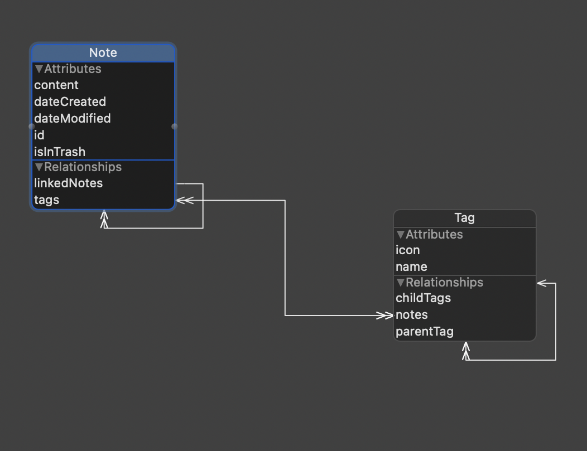

For the last few months, I’ve had an idea for a note-taking application. I came up with the idea while I was on the search for a note-taking application in the beginning of lockdown. I dabbled with writing it over the summer, but unfortunately nothing really came of it. However, with school out for winter break, I decided to seriously start working on it.

## Why? Aren’t there a dozen note-taking apps out there?

Like I mentioned earlier, I shopped around for a new note-taking application in March. I wanted an app that supported full markdown syntax, had good sync, and required minimal _friction_ (i.e. effort; a great term I first heard from Ali Abdaal) to create a new note. I was using OneNote at the time for school but I wanted to switch from it for personal use because the sync was, in my experience, all over the place and did not support markdown syntax. In my quest to find my new notes app, I looked at five contenders: Notion, Roam Research, Evernote, Apple Notes, and Bear. Each of these applications had their ups and downs and so I’ll give my observations.

### Notion

Notion, to begin with, felt overwhelming. Because the app emphasizes organization and structure, I found it difficult to quickly create a new note because I would spend too much time deciding where to put it. I would also spend a lot of time trying to create the perfect organization structure after looking in envy at other people’s Notion setups. This was a serious time drain and obviously didn’t help me become more productive. There also wasn’t an “all notes” tab that I could just dump my notes into until I could organize them. It’s also not a purely note-taking application — it has support for kanbans, relational databases, photo grids, etc. The abundance of features also contributed to the feeling of overwhelmingness. The other major problem I had is that the app itself felt slow. I personally prefer using a native app when possible so using Notion’s electron app was a bit irritating for me. When I was using the mobile app, in particular, it felt extremely laggy, often taking 5 to 15 seconds to load up. I used a OnePlus 5 at the time (which was about three years old), so the lag might’ve just been my phone. This doesn’t mean I hate Notion. In fact, I think it is great for managing a team (I setup a wiki for my robotics team through it) and creating a database (such as tracking the books you’ve read or inventory in a store). But I don’t think it’s meant for quickly writing down info to look at later, which is how I use note-taking apps.

### Roam Research

Roam Research is definitely the most innovative of the apps I tried. I found the idea of bidirectional links incredible since you can relate notes to another by content or even by metadata such as the date created and its tags. The daily notes feature was also very useful because it could function as a journal for planning out the day. It would also show the notes you created on that day, which is pretty cool. I especially appreciated the graph view where you could see how all the notes connect to one another. However, I found the price to be a bit high — $7.50/month for academics and $15/month for (mostly) everyone else. I personally don’t pay $7.50/month for any service and I don’t think I would use Roam enough to justify the price tag. The lack of a mobile app is another big downside for me because web apps on phones are finicky at best, as experienced with Notion. Overall, it’s a great app with many innovative features but a lack of native apps and its high price tag soured it for me.

### Evernote, Apple Notes, and Bear

Evernote, Apple Notes, and Bear all felt very similar to me. They all have easy-to-use UIs, a simple organization structure (folders and/or tags), and have native apps (Evernote actually may’ve switched to electron apps recently). When I tried out Evernote, it didn’t have support for different headers, only for changing the font size and weight. This was pretty dumb since I structure my notes by headers. It also only supported two devices in the free plan, but it wasn’t that big of a deal since I only really use my laptop and phone. Many people like Evernote’s API integrations and its web clipper but I didn’t find either useful, so they didn’t really help its case. Between Apple Notes and Bear, I found Bear’s markdown support and nested tagging system more appealing that Apple Note’s support for tables and its superior Apple Pencil support (I use GoodNotes for that anyways). I find it ridiculous though that Bear hasn’t added support for tables even though the app came out four years ago! The developers have been working on a new editor though (which has tables, thank god) for nearly a year and have yet to integrate it into the main app.

### Commentarium

With the extremely slow development progress of Bear, I decided it might be interesting to develop my own notes app: a better Bear, one could say. It would have all the tagging functionality, markdown syntax, support for file attachments, and overall simplicity of Bear while adding features like true bidirectional links (like those in Roam Research where you can see the notes that have been linked at the bottom) and, of course, tables. I use Bear nearly every day, so I thought it’d be neat to create an app I’d actually use. I decided to codename the project _Commentarium_, after the Latin name for _note_.

## Architectural Ramblings

Once I started taking this idea seriously, which was in the summer, I thought about how I might start. As I mentioned earlier, I prefer using native apps _a lot_ more than web/electron apps, so it made sense to program Commentarium as a desktop and mobile app. I use Apple devices, so naturally I decided to write it in Swift. I didn’t know Swift at the time but knowing Python, Java, and C, it was actually pretty easy to pick up. [_A Swift Tour_](https://docs.swift.org/swift-book/GuidedTour/GuidedTour.html) is a great place to get started. Writing exclusively for the Apple ecosystem gives you the benefit of utilizing frameworks such as Core Data (an object-oriented wrapper around a local data store, usually SQLite) and CloudKit (which, with minimal code changes, can sync a Core Data store to iCloud). I wanted to take a local-first approach and have support for sync anyway so using Core Data and CloudKit seemed like a no-brainer. I also wanted to be able to store relationships between models easily, so Core Data made more sense than, say, storing data locally on a bunch of markdown or json files. On a side note, I decided to make Commentarium open source so that people can see how I’m writing the code as I’m progressing, and it could be useful for someone looking to see what a good iOS/macOS codebase looks like in the future.

I’ve never really built an app on such a large scale (most of my projects are petty scripts in comparison), so I wasn’t really sure where to start. I first dived right into the code and created a basic prototype in SwiftUI; it allows the user to add and delete notes with some basic support for tags (without nesting or user modification). I had learned SwiftUI in the summer, when I first decided to start working on Commentarium, so it was pretty easy to put together. SwiftUI’s declarative nature and reactive view updating were really cool but I ran into a few glitches. The showstopper bug (not really) I ran into was in regards to Core Data and Combine. For whatever reason, my view would not update when I clicked on the _Add new note_ button (meaning no new notes would slide in) unless I clicked on a different sidebar tab and back. Then it would work perfectly as if nothing happened. Strangely, this only happened in the _All_, _Untagged_, and _Trash_ tabs but not any in the _Tags_ section. I thought it had something to do with the `NSPredicate` I was using in the `@FetchRequest` call but it was perfectly valid. Even more bizarre, it only happened on macOS; when I ran the app on iOS, it didn’t have this problem. Needless to say, I filed a bug report in Feedback Assistant so hopefully Apple will fix this bug by macOS 11.2 or 11.3.


After building this basic prototype, I decided to step back and plan out the data model more thoroughly and whether I should stick with SwiftUI. I decided on two main models — Note and Tag — and they would be related to each other through the `Note.tags` and `Tag.notes` relationships. Fundamentally, a Note can have many tags and a Tag can have many notes. Since tags could be nested, I decided to represent the hierarchy as a Tree abstract data type and added a `childTags` property, like a Node in a Tree would have. The full data model is shown below.



What took me longer to think of was how to store attachments (like images, PDFs, etc.) and display referenced notes (like Roam has). After doing [some research](https://www.vadimbulavin.com/how-to-save-images-and-videos-to-core-data-efficiently/), I found that storing attachments would best be done on a device’s file system rather than in the database. Therefore, I figured I would save the attachment's file system path as a Markdown link inside the note’s `content` and have the editor display the actual attachment when a note is opened. I also thought it would be best to implement the referenced notes feature in the database since it would be far more computationally expensive to look through all the notes’ contents on launch and then store references in a list. Therefore, I created a `linkedNotes` relationship so that each note can display the referenced notes section based on that list of notes. The general algorithm I have for implementing this is as follows:

```
when backlink is created:
    let currentNote = note that we are currently in
    let linkedNote = note that we linked to in the currentNote
    add currentNote to linkedNote's .linkedNotes property
    persist to database
```

I haven’t tested either of these ideas at all so they may change when I start working on that part of the app. That was pretty much all I could think of for the model given the features I wanted.

Most of the work in this app will definitely be in the UI, particularly in the editor. After doing some more research, I found that the best way to write the editor would be to use a framework called TextKit. Unfortunately, this is only available for AppKit and UIKit, not SwiftUI. Since the rest of my app layout is pretty minimal (really just two list views) and meat of the app would be done in UIKit/AppKit anyway, I decided to write the whole thing in UIKit/AppKit. Although it will be a pain to maintain two separate codebases for macOS and iOS and much more annoying to write imperatively than declaratively, I think it’ll be worth it for greater customization, fewer bugs, and significantly more useful documentation (don’t even get me started on SwiftUI’s documentation — just look at [this excuse for documentation](https://developer.apple.com/documentation/swiftui/sidebarliststyle)).

I’ve never actually programmed in UIKit or AppKit, but I found some resources which should help me get up to speed — recordings of [Stanford CS193P](https://www.youtube.com/watch?v=TZL5AmwuwlA&list=PL3d_SFOiG7_8ofjyKzX6Nl1wZehbdiZC_) from Fall 2017, [Hacking with Swift’s free UIKit course](https://www.hackingwithswift.com/read), [_Hacking with macOS_](https://www.hackingwithswift.com/store/hacking-with-macos), which I picked up on Black Friday this year, and of course, [Apple's WWDC sessions](https://developer.apple.com/videos/). Since both frameworks have the same fundamental concepts, I’m planning on learning UIKit first, since there’s much more material out there, and then use _Hacking with macOS_ to learn macOS's differences.

## Closing Remarks

If anyone has actually gotten this far, please send me a message on Twitter or shoot me an email just so I know that my work is being read as this is my first-ever blog post. Thanks for reading!
